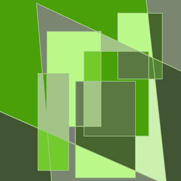

# ForestProof

Объяснимый веб-сервис мониторинга, отчётности и проверки (MRV) лесных климатических проектов.


---

## Что это

**ForestProof** — исследовательский MVP для кейса **«Спутниковая верификация “зелёных” инвестиций и углеродных кредитов»** КосмоХакатона 2026. Сервис позволяет верификатору задать участок леса в WGS 84 и период **2019–2024** и получить объяснимый, воспроизводимый результат проверки климатического проекта по открытым спутниковым данным.

Основной пользователь — **верификатор**. Дополнительно: владелец проекта, инвестор, банк/фонд, ESG-аналитик, орган власти.

### Что делает сервис

1. Проверяет геометрию полигона и доступность данных.
2. Считает площадь по **фактическому пересечению пикселей** с полигоном (а не по bounding box).
3. Рассчитывает запас углерода `C_t` на начало и конец периода по **ESA CCI Biomass v7.0** (AGB и AGB_SD).
4. Строит годовую динамику `C_t` и `c̄_t`.
5. Находит пространственные **зоны изменений** и сопоставляет их с **GFC**, **Sentinel-2** и **MODIS**.
6. Оценивает **неопределённость** `L/U/H` и пригодное покрытие.
7. Сравнивает результат с **baseline** кейса и считает **потенциальные углеродные единицы** `Q` по правилам кейса.
8. Формирует **HTML/PDF/JSON-отчёт** с картой, источниками, параметрами, `run_id` и SHA-256.

### Что сервис не делает

Не сертифицирует единицы, не устанавливает юридическую дополнительность, не измеряет весь углерод экосистемы, не доказывает реальный выброс, не заменяет наземную инвентаризацию, не определяет виновника нарушения, не проводит официальную торговлю или выпуск в реестр.

> Во всех расчётах учитываемый пул — **живая надземная древесная биомасса**. Корни, мёртвая древесина, подстилка, почва и древесная продукция в обязательный расчёт не входят. Положительный `Eproj` означает потерю углерода из учитываемого пула, но не доказывает немедленный выброс в атмосферу.

---

## Архитектура

```
                    ┌─────────────────────────────┐
                    │        Frontend (SPA)       │
                    │  React 19 + Vite + nginx    │
                    └──────────────┬──────────────┘
                                   │ /api/v1  (proxy)
                                   ▼
                    ┌─────────────────────────────┐
                    │      Gateway (Go 1.26)      │  публичный API,
                    │  STAC, кэш, задания, слои   │  статусы, отдача слоёв
                    └──────────────┬──────────────┘
                                   │ HTTP (внутренний контракт)
                                   ▼
                    ┌─────────────────────────────┐
                    │    Backend (C# / .NET 10)   │  GDAL, геометрия,
                    │  расчёты, зоны, отчёт, БД   │  формулы, QuestPDF
                    └──────────────┬──────────────┘
                                   │ Npgsql + NetTopologySuite
                                   ▼
                    ┌─────────────────────────────┐
                    │   PostgreSQL 16 + PostGIS   │
                    └─────────────────────────────┘
```

- **Go-шлюз** — единственный публичный API: каталог источников, SHA-256, STAC-поиск и кэш, жизненный цикл фоновых расчётов, отдача слоёв для карты.
- **C# backend** — все вычисления: растры, геометрия и площади, запас и изменение, неопределённость, baseline, единицы, зоны изменений, спектральные индексы, отчёт и provenance.
- **PostgreSQL/PostGIS** — сохранение запусков анализа, метрик, зон, отчётов.

---

## Технологии и библиотеки

### Backend: C# / .NET 10


| Библиотека | Версия | Назначение |
|---|---|---|
| `Microsoft.NET.Sdk.Web` | net10.0 | Minimal API, DI, конфигурация |
| `MaxRev.Gdal.Core` + `MaxRev.Gdal.LinuxRuntime.Minimal` | 3.13.3 | чтение GeoTIFF (AGB, AGB_SD, GFC, MODIS, Sentinel-2) без системного GDAL |
| `NetTopologySuite` + `NetTopologySuite.IO.GeoJSON` | 2.6.0 / 4.0.0 | геометрия, репроекция, площади пересечений |
| `DotSpatial.Projections` | 4.0.656 | пересчёт CRS (WGS 84 → EPSG:6933) |
| `Microsoft.EntityFrameworkCore` | 10.0.12 | ORM |
| `Npgsql.EntityFrameworkCore.PostgreSQL` + `.NetTopologySuite` | 10.0.3 | PostgreSQL/PostGIS-провайдер |
| `CsvHelper` | 33.1.0 | чтение методических CSV |
| `QuestPDF` | 2026.7.3 | генерация PDF-отчёта |
| `Scrutor` | 7.0.0 | автоматическая регистрация сервисов |
| `Microsoft.AspNetCore.OpenApi` | 10.0.10 | OpenAPI |

### Gateway: Go 1.26


Стандартная библиотека (`net/http`, `encoding/json`, `crypto/sha256`, `context`) — без внешних зависимостей. Реализованы: публичный API `/api/v1`, кэш заданий на диске, STAC-клиент Earth Search, верификация SHA-256, отдача слоёв.

### Frontend: JavaScript / React


| Библиотека | Версия | Назначение |
|---|---|---|
| `react` / `react-dom` | 19.3 | UI |
| `vite` + `@vitejs/plugin-react` | 8.3 | сборка и dev-сервер |
| `antd` + `@ant-design/icons` | 6.6 | компоненты и иконки, русская локаль |
| `@tanstack/react-query` | 5.103 | загрузка данных и кэш запросов |
| `maplibre-gl` | 6.10 | карта, полигоны и зоны |
| `echarts` + `echarts-for-react` | 6.1 | графики годовой динамики и неопределённости |
| `react-router-dom` | 7.18 | маршрутизация SPA |

### Инфраструктура


| Компонент | Версия | Роль |
|---|---|---|
| `postgis/postgis` | 16-3.4 | БД и геопространственные типы |
| `nginx` | 1.27-alpine | раздача SPA и проксирование `/api` на Go-шлюз |
| Docker Compose | v2 | оркестрация четырёх сервисов |

---

## Быстрый старт

Требуется только один предварительный шаг — запустить скрипт. Он **сам установит Docker** (и всё необходимое), если тот ещё не установлен, а затем соберёт и поднимет проект.

### macOS / Linux

```bash
./start.sh
```

Скрипт:
- определяет ОС и менеджер пакетов (`apt`, `dnf`, `yum`, `zypper`, `pacman`);
- на Linux ставит Docker Engine через официальный `get.docker.com` (при недоступности — из пакетов дистрибутива), включает `systemctl`, добавляет пользователя в группу `docker`;
- на macOS при отсутствии Homebrew устанавливает его и ставит Docker Desktop;
- дожидается готовности демона и выполняет `docker compose up --build -d`.

Дополнительные команды:

```bash
./start.sh logs -f    # смотреть логи
./start.sh ps         # статус контейнеров
./start.sh down       # остановить
./start.sh down -v    # остановить и удалить БД
```

### Windows

```bat
start.bat
```

Скрипт:
- ищет Docker; если его нет — ставит **Docker Desktop** через `winget` (`Docker.DockerDesktop`), а при отсутствии winget — через **Chocolatey**;
- прописывает путь к Docker CLI, запускает Docker Desktop и ждёт готовности движка;
- выполняет `docker compose up --build -d`.

> Если в PowerShell запуск `.bat` заблокирован, используйте `cmd /c start.bat` или разрешите скрипт. Для установки через `winget`/`choco` может потребоваться запуск от имени администратора.

### После запуска

| Сервис | Адрес |
|---|---|
| Frontend (веб-интерфейс) | http://localhost:5173 |
| Go-шлюз (healthcheck) | http://localhost:5300/healthz |
| PostGIS | `localhost:5432` (`forestproof` / `forestproof`) |

Полная остановка с удалением данных БД:

```bash
docker compose down -v
```

---

## Советы по Windows и WSL2

Docker Desktop на Windows работает через **WSL2** — это рекомендуемый и самый стабильный режим.

1. Установите WSL2 и перезагрузитесь:
   ```powershell
   wsl --install
   wsl --set-default-version 2
   ```
2. Включите виртуализацию в BIOS/UEFI (Intel VT-x / AMD-V).
3. Убедитесь, что в Docker Desktop выбран бэкенд **WSL 2** (Settings → General → Use the WSL 2 based engine).
4. Запускайте `start.bat` из **cmd** или **PowerShell**. После установки Docker Desktop может потребоваться повторный вход в систему (пользователь добавляется в группу `docker-users`).
5. Для максимальной производительности держите репозиторий **внутри файловой системы WSL** (`\\wsl$\...`, например `~/projects/ForestProof`), а не на диске `C:` — сборка и обмен файлами с контейнерами будут заметно быстрее.
6. Если порт `5173`, `5300` или `5432` занят, освободите его или измените публикуемый порт в `docker-compose.yml`.
7. При проблемах с DNS в контейнерах проверьте `wsl --shutdown` и перезапуск Docker Desktop.

---

## Совместимость с РЕД ОС и Astra Linux

Проект **стабильно и качественно работает на РЕД ОС и Astra Linux**. Обе системы поддерживаются скриптом `start.sh`:

- **Astra Linux** — Debian-подобная система, используется `apt` (при необходимости скрипт доустановит `curl` и пакеты Docker).
- **РЕД ОС** — RPM-система, используются `dnf`/`yum` (установка Docker Engine через официальный репозиторий либо пакеты дистрибутива).

Дополнительно:

- контейнеры основаны на официальных образах `mcr.microsoft.com/dotnet/aspnet:10.0`, `golang:1.26-alpine`, `node:22-alpine`, `nginx:1.27-alpine`, `postgis/postgis:16-3.4`;
- GDAL поставляется как нативный runtime NuGet-пакета (`MaxRev.Gdal.LinuxRuntime`), поэтому **системный GDAL/PROJ/GEOS устанавливать не нужно**;
- всё взаимодействие между сервисами идёт по внутренней docker-сети, наружу публикуются только фронтенд, шлюз и порт БД.

Если в РЕД ОС или Astra Linux недоступен `get.docker.com`, скрипт автоматически переходит на установку Docker из репозиториев дистрибутива. При необходимости запустите вручную:

```bash
sudo systemctl enable --now docker
sudo usermod -aG docker "$USER"
# затем выйдите и войдите заново
```

---

## Публичный API (Go-шлюз, `/api/v1`)

| Метод | Путь | Назначение |
|---|---|---|
| `POST` | `/api/v1/analyses` | создать расчёт (GeoJSON или `aoiId`, годы, профиль метода) |
| `GET` | `/api/v1/analyses/{id}/status` | фаза, прогресс, предупреждения |
| `GET` | `/api/v1/analyses/{id}/summary` | площадь, `C_t`, `Eproj`, `L/U`, coverage, baseline, `R`, `Q` |
| `GET` | `/api/v1/analyses/{id}/changes` | GeoJSON зон с evidence |
| `GET` | `/api/v1/analyses/{id}/layers` | список слоёв для карты |
| `GET` | `/api/v1/analyses/{id}/layers/{layer}` | слой (файл/тайл) |
| `POST` | `/api/v1/analyses/{id}/reports` | сформировать отчёт (`pdf`/`html`/`json`) |
| `GET` | `/api/v1/areas` | каталог AOI |
| `GET` | `/api/v1/sources` | каталог источников, версий и хэшей |
| `GET` | `/api/v1/projects` | реестр проектов |
| `GET` | `/api/v1/experiments/sensitivity` | сравнение сценариев (`k=1`/`k=2`, SCL strict/extended) |
| `GET` | `/healthz` | проверка живости шлюза |

Расчёт идемпотентен: одинаковый `input_hash + method_version` даёт тот же результат.

---

## Структура репозитория

```
ForestProof/
├── Assets/                     # логотип и материалы
├── Backend/
│   ├── Docker/                 # Dockerfile'ы и nginx.conf
│   ├── Dotnet/
│   │   ├── ForestProof.Backend/    # C# backend (расчёты, API, БД)
│   │   └── ForestProof.Testing/    # xUnit-тесты
│   ├── Go/                     # Go-шлюз
│   └── openapi.json
├── Frontend/                   # React SPA
├── Skills/                     # внутренние гайды по стилю и тестам
├── docker-compose.yml          # 4 сервиса
├── start.sh                    # установка + запуск (macOS/Linux)
├── start.bat                   # установка + запуск (Windows)
└── README.md
```

---

## Ограничения и дисклеймер

- Сервис не является сертификацией климатического проекта, юридическим заключением или утверждением о фактическом объёме выбросов.
- Диапазон `L–U` имеет **сценарный** статус и не является доверительным интервалом.
- **GFC** подтверждает факт потери покрова, но не причину; **MODIS** — сигнал возможной гари.
- Рассчитанные единицы — **потенциальные, не сертифицированные**, «расчёт по условиям кейса».

---

**ForestProof** · КосмоХакатон 2026 · спутниковая верификация углеродных проектов
